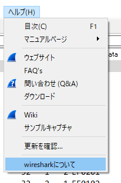
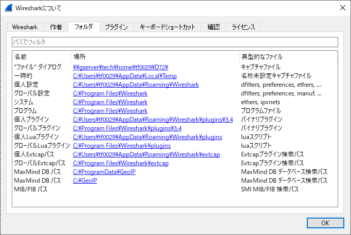
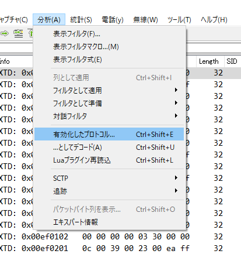
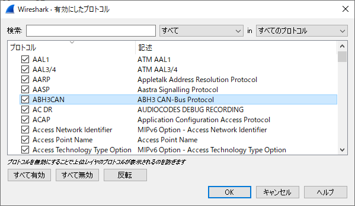
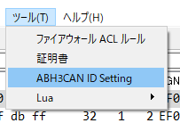
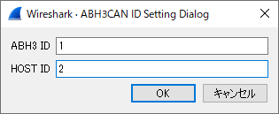
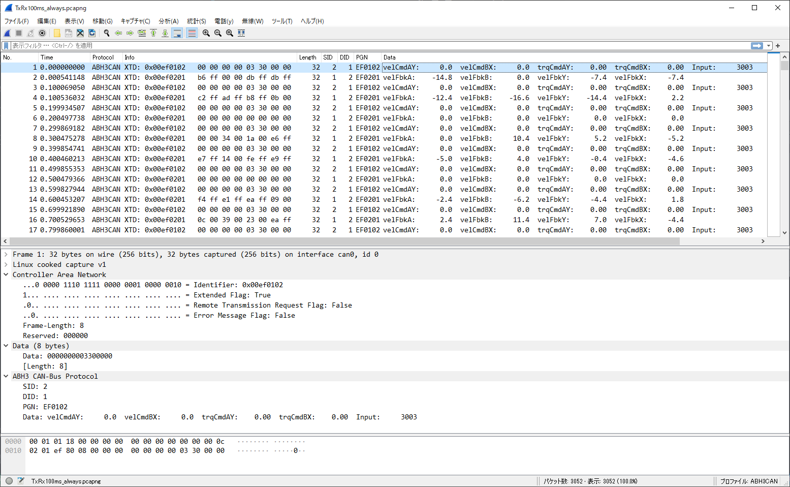

# abh3_CAN-Bus_Wireshark
Wireshark Plugin for ABH3-CAN

- 個人LuaプラグインフォルダかグローバルLuaプラグインフォルダにコピーしてください。

  
  

- プロトコルの有効／無効を設定

  
  

- ABH3とホスト機器のIDを設定

  
 

- 表示例

 

**_Version History_**
* __v1.0__(2021/7/30)
    - first release
 
